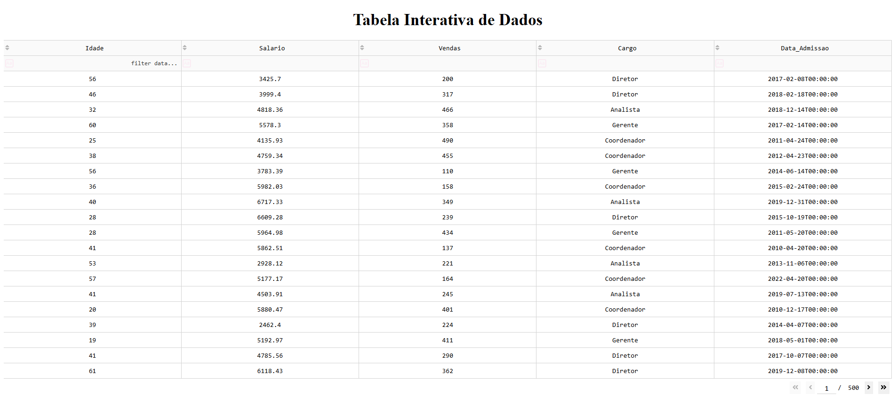
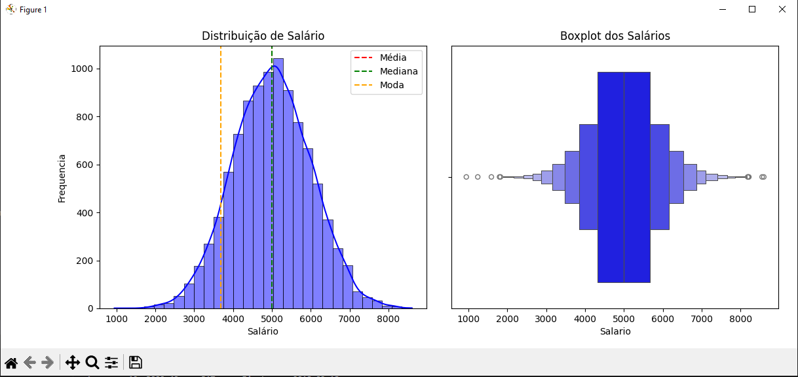
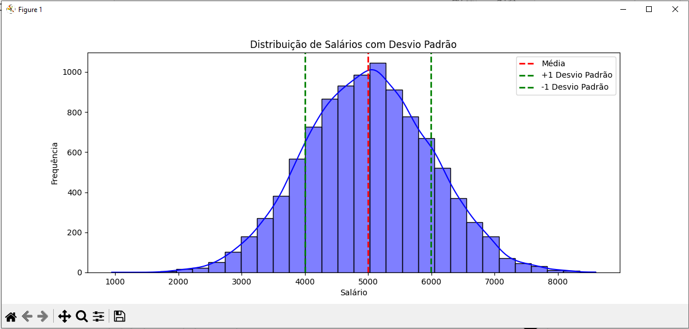
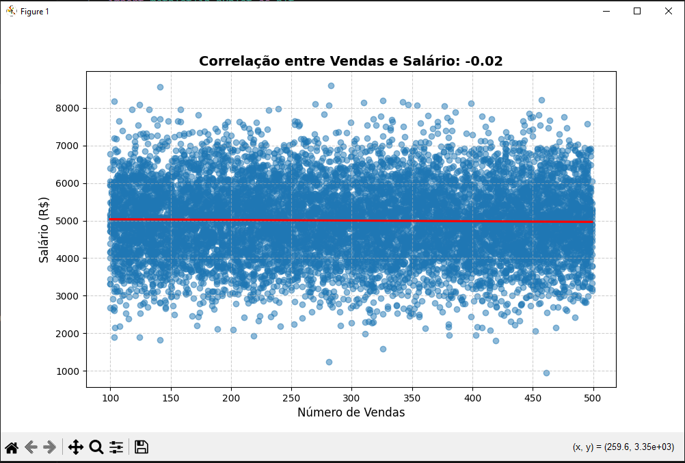
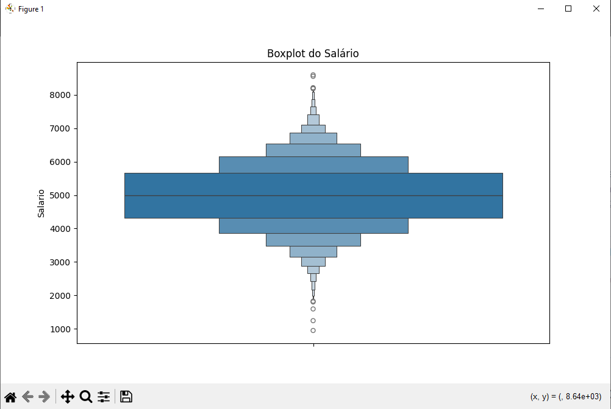

# Análise Estatística com Python

Este projeto é um treinamento que faço para aprender a trabalhar com análise exploratória de dados (EDA) e aplicar técnicas de estatística descritiva e visualização de dados. As bibliotecas como pandas, seaborn, matplotlib e scipy são essenciais para análise e visualização eficaz de dados em Python. Foram utilizados dados fictícios para a prática de testes estatísticos, visualização de distribuições e análise de diferentes grupos.

# Objetivos
Este projeto visa:
- Criar um conjunto de dados fictício para análise estatística.
- Explorar estatísticas descritivas como média, mediana e desvio padrão.
- Criar histogramas para entender a distribuição dos dados.
- Analisar tendências ao longo do tempo (exemplo: Data de Admissão dos funcionários).
- Comparar diferentes grupos de cargos e calcular a média de vendas por cargo.
- Aplicar testes estatísticos como o teste t de Student para verificar diferenças entre grupos.

## Tecnologias Utilizadas
- Python: Linguagem de programação principal.
- pandas: Biblioteca para manipulação de dados em formato tabular.
- numpy: Biblioteca para operações numéricas.
- matplotlib: Biblioteca para visualização de gráficos.
- seaborn: Biblioteca para visualização de dados baseada no matplotlib.
- scipy.stats: Biblioteca para cálculos estatísticos (usada em testes de hipóteses e correlações).
- Scikit-Learn: Modelagem de regressão linear.

## Geração dos Dados Fictícios

- O dataset é criado utilizando NumPy e Pandas, gerando informações como:
- Idade (entre 18 e 65 anos)
- Salário (média de R$5000,00 com desvio padrão)
- Número de Vendas (entre 100 e 500 por mês)
- Cargo (Analista, Gerente, Coordenador, Diretor)
- Data de Admissão (aleatória entre 2010 e 2023)

## Captura de Tela:

### DataSet

### Media - Mediana - Moda

 - Histograma: mostra a distribuição dos salários.
 - Linha Vermelha: representa a média dos salários.
 - Linhas Verdes: indicam um desvio padrão acima e abaixo da média.

### Desvio_Padrão e Variancia

### Correlação vendas e salário

### Correlação vendas e salário

